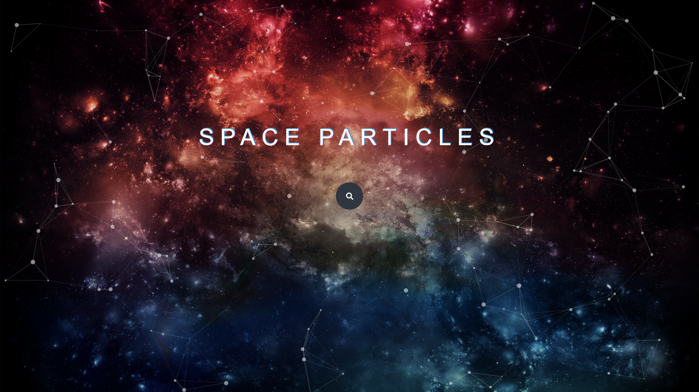

# SpaceParticle

Used HTML, CSS, JavaScript, Particle.js to create a web page which simulates space like particles and also has a link to a search engine

#Update:
>Added a search bar to directly search using Starpage.com
>Used JavaScript to get and search using the search bar
>Used CSS to create a Glitch feature on the text

